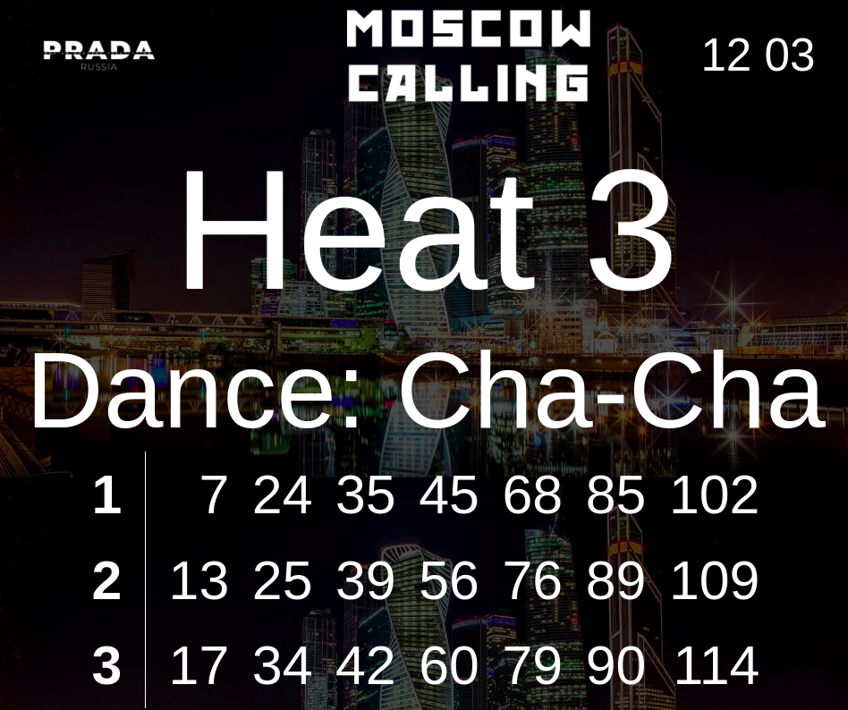
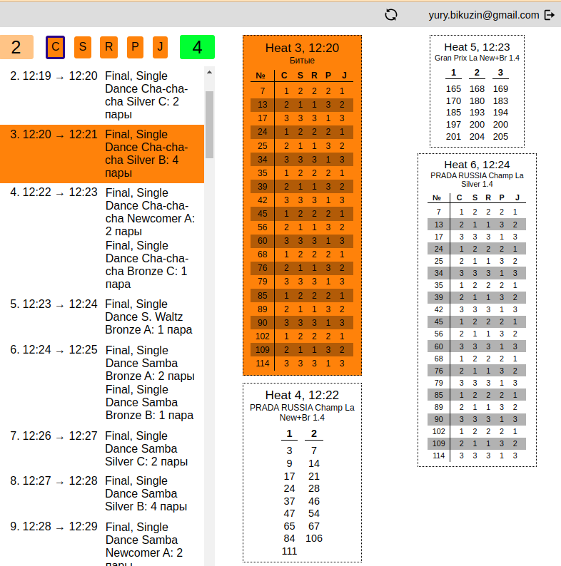
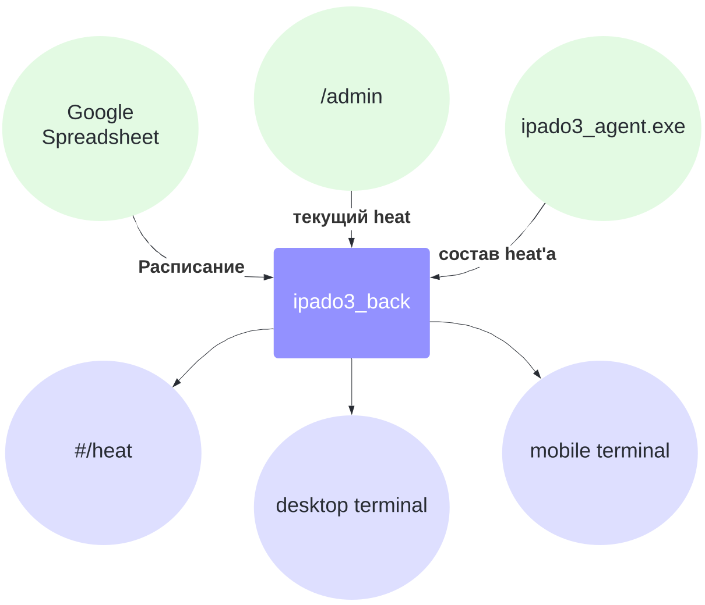

# ipado

## Постановка задачи

### Что есть?

Есть расписание турнира по бальным танцам, которое заранее загружено организаторами турнира в [Google-таблицу](https://docs.google.com/spreadsheets/d/1QsodW0afu8Ql3ujD1VrfOVHxKvf9xBF6HXVZ5FQLjZA)

Есть оператор, который находится в танцевальном зале в во время турнира. 

Его задачей является:
- указание текущего танцевального захода (меняется каждые 1-10 минут)
- подготовка в реальном времени деталей (состава - списка номеров танцевальных пар) следующих танцевальных заходов на основе результатов предыдущих заходов (то есть списка пар, прошедших в следующий тур на основе результатов предыдущего в своей категории)

### Что требуется?

Требуется HEAT-табло в зале, на котором крупно написан номер текущего захода и, если есть, его детали (состав - список номеров танцевальных пар)

Требуется подробное (с указанием состава следующих заходов) расписание на большом экране у выхода на танцевальный паркет

Требуется возможность открыть расписание на любом (и одновременно нескольких) мобильных телефонах для возможности в реальном времени следить за ходом турнира

## Архитектура решения

### Пользовательский интерфейс

Для вывода информации будем использовать web-интерфейс в 3-х разных вариантах

### HEAT-табло

[Демо](https://ipado.ru/demo/#/heat)

### Подробное расписание

[Демо](https://ipado.ru/demo/) - следует открывать на desktop'е

### Расписание для мобильного устройства

[Демо](https://ipado.ru/demo/) - следует открывать на мобильном устройстве

### Админка

Кроме того, интерфейс оператора по управлению текущим заходом сделаем с применением аналогичной (web-) технологии:

[Демо](https://ipado.ru/demo/admin) - следует открывать на desktop'е

## Схема движения данных

### Источники данных

Источниками данных у нас являются:
- [Google Spreadsheet](https://docs.google.com/spreadsheets/d/1QsodW0afu8Ql3ujD1VrfOVHxKvf9xBF6HXVZ5FQLjZA)
- админка оператора
- программа-агент, запущенная на ноутбуке оператора и следящая за появлением в специально отведенной папке файлов с нужным расширением (.heats) и за изменениями в этих файлах. Каждый такой файл содержит состав (список номеров танцевальных пар) захода. Такие файлы оператор готовит самостоятельно при помощи своего инструмента

### Получатели данных

Получателями данных у нас являются:
- HEAT-табло
- Подробное расписание (desktop terminal)
- Мобильные устройства (mobile terminal)

## Программные модули

- ipado3_back - исполняемый файл, запущенный на сервере (Ubuntu 20+)

    - в момент старта обращается к Google-таблице за расписанием и переходит в режим ожидания установки с ним websocket-соединений со стороны ipado3_agent.exe, ipado3_front 
    - после установки websocket-соединения с ipado3_agent.exe ожидает отправки последним файлов .heats на ноутбуке оператора
    - после установки websocket-соединения с ipado3_front, работающего в режиме админки,  ожидает отправки последним данных о номере текущего захода
    - все полученные и получаемые данные (расписание, номер текущего захода, состав захода) рассылает всем экземплярам ipado3_front, установившим с ipado3_back websocket-соединение

- ipado3_agent.exe - исполняемый файл, запущенный на ноутбуке оператора (Windows 10+)

    - в момент старта устанавливает с ipado3_back websocket-соединение
    - просматривает текущую (из которой был запущен) папку на предмет наличия в ней файлов \*.heats
    - все обнаруженные \*.heats-файлы передает ipado3_back
    - переходит в режим мониторинга появления/удаления/изменения \*.heats-файлов в текущей папке с немедленным уведомлением ipado3_back

- ipado3_front - WASM-файл, работающий в [браузере клиента](https://caniuse.com/wasm)

    - в момент старта устанавливает с ipado3_back websocket-соединение
    - получает в реальном времени данные от ipado3_back и отражает их в web-интерфейсе
    - работает в 3-х режимах:
        - [админка](https://ipado.ru/demo/admin/)
        - [HEAT-табло](https://ipado.ru/demo/#/heat)
        - [пользовательский терминал](https://ipado.ru/demo/): в зависимости от устройства пользователя реализует либо функциональность desktop terminal, либо mobile terminal; определяется таблицей стилей
    - работая в режиме "админка", передает ipado3_back номер текущего захода, которые изменяет оператор

## Объяснение архитектурных решений

### Websocket

Websocket как способ связи между ipado3_front и ipado3_back был выбран, чтобы передача данных клиенту могла происходить по инициативе сервера. В таком случае, чтобы отразить изменения на клиенте (смену номера текущего захода, изменения в составе захода), клиенту не нужно предпринимать активных действий (перезагружать страницу)

Websocket как способ связи между ipado3_agent.exe и ipado3_back был выбран, чтобы избежать возможной блокировки попытки установки соединения с внешним сервером с ноутбука оператора (wss-соединение устанавливаетя по 443-порту, как и все https-соединения)

### WASM

WASM (gzip len 700K) был выбран, чтобы для написания клиента (ipado3_front) на Rust можно было использовать библитеку (ipado3_common) общую с ipado3_back, содержающую описание структур данных, передаваемых от сервера клиенту и обратно, таким образом, минимизировав риски по рассинхронизации структур данных при развитии проекта

## Детали реализации

Разработка велась на Ubuntu 22

### ipado3_front

Клиент написан на Rust с использование реактивной библиотеки [dominator](https://crates.io/crates/dominator)

Компилируется в WASM (gzip len 700K)

Работает в [браузере клиента](https://caniuse.com/wasm)

### ipado3_back

Сервер написан на Rust с использованием библиотек:
- [tokio](https://crates.io/crates/tokio) - как async-runtime
- [warp](https://crates.io/crates/warp) - для реализации web(socket)-сервера
- [google-sheets4](https://crates.io/crates/google-sheets4) - для чтения Google-таблицы

Компилируется с указанием `--target x86_64-unknown-linux-musl` для статической линковки всех (возможно) необходимых библиотек. В результате получается standalone монолит 20MB, не нуждающийся в динамических зависимостях. Что упрощает процедуру деплоя

Во время эксплуатации ipado3_back запускается как systemd-сервис и размещается за [реверсиным прокси Nginx](https://docs.nginx.com/nginx/admin-guide/web-server/reverse-proxy/), который также берёт на себя работу с SSL-сертификатами, избавляя web(socket)-сервер ipado3_back от необходимости реализации этой функциональности

### ipado3_agent

Программа-agent для Windows написана на Rust с использование библиотек:
- [notify](https://crates.io/crates/notify) - для реализации мониторинга папки
- [websockets](https://crates.io/crates/websockets) - для реализации websocket-клиента

Кросс-компилируется на Ubuntu для Windows с указанием `--target x86_64-pc-windows-gnu`.
В результате получается standalone монолит 26MB, не нуждающийся в динамических зависимостях. Что упрощает процедуру

